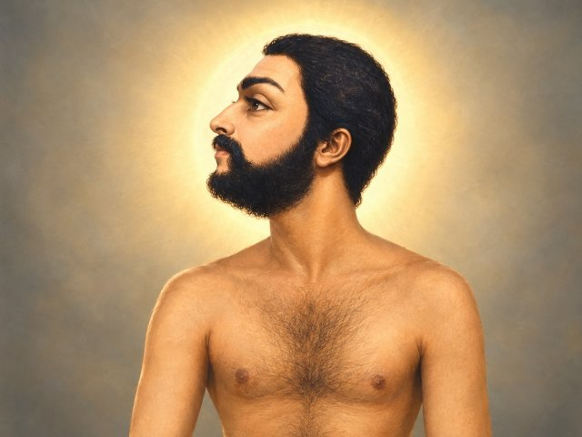

# Sadhaashiva Brahmendra Swaami 

"… ஒரு நிர்வாண மனிதன் அடிக்கடி என்னிடம் வருகிறான். விளையாடுவான். போதிப்பான். சென்றுவிடுவான். அவன் யாரென்று என்னால் அறிய முடிந்ததில்லை. ஆனால் அவன் வரும் நேரமெல்லாம் என் ஆன்மா பரிபூரண நிறைநிலையை அடையும் என்பதை உணர்ந்திருக்கிறேன்.."

— ஸ்ரீ பகவான் ஸ்ரீ ராமகிருஷ்ண பரமஹம்ஸர்

"… ಒಬ್ಬ ನಿರ್ವಾಣ ಮನುಷ್ಯ (ಮುಕ್ತ ಆತ್ಮ) ಆಗಾಗ್ಗೆ ನನ್ನ ಬಳಿಗೆ ಬರುತ್ತಾನೆ. ಅವನು ಆಡುತ್ತಾನೆ, ಉಪದೇಶಿಸುತ್ತಾನೆ. ಅವನು ಹೋಗುತ್ತಾನೆ. ಅವನು ಯಾರೆಂದು ನನಗೆ ತಿಳಿಯಲಿಲ್ಲ. ಆದರೆ ಅವನು ಬರುವ ಪ್ರತಿ ಬಾರಿಯೂ, ನಾನು ನನ್ನ ಆತ್ಮದ ಪೂರ್ಣ ಪರಿಪೂರ್ಣತೆಯ ಸ್ಥಿತಿಯನ್ನು ತಲುಪುತ್ತೇನೆ ಎಂದು ನಾನು ಅರಿತುಕೊಳ್ಳುತ್ತೇನೆ."

— ಶ್ರೀ ಭಗವಾನ್ ಶ್ರೀ ರಾಮಕೃಷ್ಣ ಪರಮಹಂಸ

"… एक निर्वाण पुरुष (मुक्त आत्मा) अक्सर मेरे पास आता है। वह खेलता है, उपदेश देता है। वह चला जाता है। मैं यह नहीं जान पाया कि वह कौन है। लेकिन जब भी वह आता है, मैं यह अनुभव करता हूँ कि मैं अपनी आत्मा की पूर्ण पूर्णता की स्थिति को प्राप्त करता हूँ।"

— श्री भगवान श्री रामकृष्ण परमहंस

"… A Nirvana Man (a liberated soul) comes to me often. He plays, he teaches. He goes away. I have not been able to know who he is. But every time he comes, I realize that I attain my soul's full state of completeness."

— Sri Bhagavan Sri Ramakrishna Paramahamsa

The above praise was showered by Ramakrishna on a jeevanmuktha by name sadhasiva brahmendra. 

Sadasiva Brahmendra – Biodata, Powers & Nerur Ashram

1. A Brief Biodata
Sadasiva Brahmendra was a 17th–18th century Advaita saint and Carnatic music composer, with his primary ashram and Jeeva Samadhi located at Nerur, near Karur in Tamil Nadu.

Early Life
Born as Sivaramakrishna to a Telugu Brahmin couple, Moksha Somasundara Avadhani and Parvati.

Lived in Kumbakonam, Tamil Nadu.

Discipleship
Left home in search of truth.

Became a disciple of Sri Paramasivendra Saraswati (the 57th Shankaracharya of Kanchi).

Studied under him for 18 years.

Avadhuta State
After his training, he wandered as a naked or semi-naked Avadhuta (a liberated soul), often in a trance-like state.

His guru famously remarked, "If only others had such madness!"

Literary Works
Authored several Advaita texts, including the Atma Vidya Vilasa.

Composed Carnatic songs in Sanskrit.

Popular compositions include Manasa Sancharare, Bhajare Gopalam, and Pibare Rama Rasam.

2. The Powers of Sadasiva Brahmendra
Sadasiva Brahmendra was a jivanmukta (liberated while living) and a profound Advaita Vedanta scholar. His life was marked by extraordinary miracles that arose naturally from his state of complete absorption in Brahman.

The Nature of His "Powers"
His "powers" were not acquired through striving for siddhis. They manifested spontaneously from his total detachment from the body and the world. His guru, Paramasivendra Saraswati, when told his disciple appeared mad, famously replied, "Ah! If only others had such madness!"

Documented Miracles (Siddhis)
Surviving Burial: Deep in samadhi on a riverbank, he was swept away by a flood and buried under sand for months. When villagers digging sand struck his head with a shovel, he calmly rose and walked away.

Regrowing a Severed Arm: A Muslim officer, enraged by his unkempt appearance, severed his forearm with a sword. Sadasiva, unaware, continued walking. When the officer begged forgiveness, the saint stroked the wound, and a new arm grew in its place.

Bilocation & Teleportation: He was seen in multiple places simultaneously. He once instantly transported children to Madurai to see a festival and brought them back before dawn.

Paralyzing Attackers: When thugs tried to beat him with sticks, their arms became frozen in mid-air until he left.

Saving Lives: He brought back to life a girl who had died from a cobra bite.

Unharmed by Boiling Liquid: He drank boiling molasses without any injury.

The Source of His State
His poetic work, Atma Vidya Vilasa, describes the state of the liberated being. The sage "sports like a child" in the ocean of bliss, "wanders like a deaf, blind idiot," with the quarters as his garments and desirelessness as his ornament. His powers were not separate from this state—they were the natural radiance of a life fully established in the Self, where the body and its limitations no longer held sway.

3. The Nerur Ashram (Adhishtanam)
The Arulmigu Sadasiva Brahmendra Adhishtanam at Nerur is the primary shrine dedicated to his Jeeva Samadhi.

Location
Nerur is a village located 13 km from Karur on the banks of the Kaveri River in Tamil Nadu.

Rediscovery
The site remained largely unrecognized for nearly a century.

It was rediscovered by Sri Sacchidananda Shivabhinava Narasimha Bharati, the 33rd Shankaracharya of Sringeri, who was divinely guided to find it.

He composed 45 verses in praise of Sadasiva Brahmendra there.

Current Status
The ashram complex houses the Samadhi and a Kashi Vishwanatha temple.

Annual Aradhana festivals are held here.

